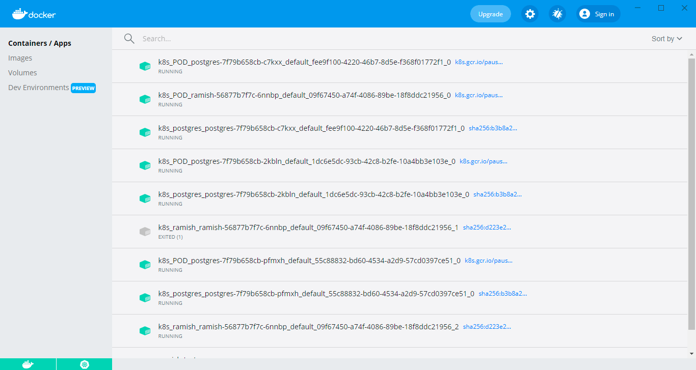
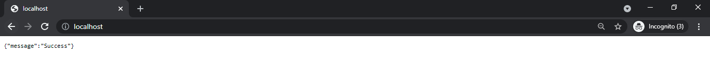
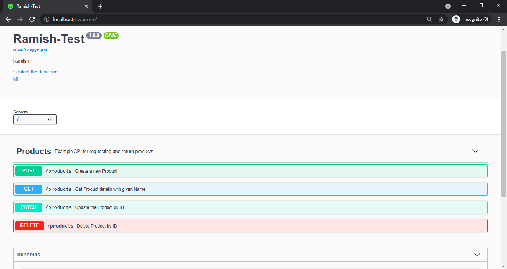
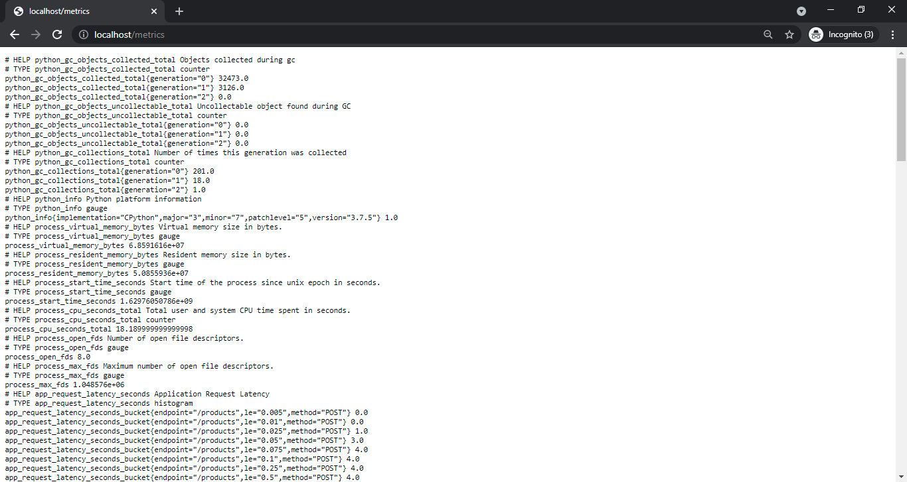
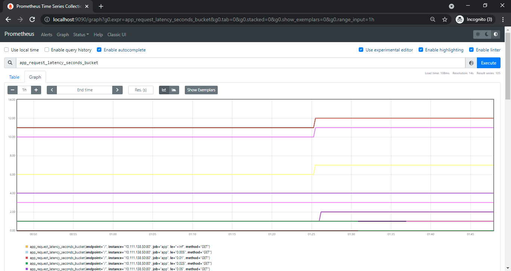

# ramish-test
Kubernetes and Prometheus and Python and Flask. 24 hours x $8.

#### Flask
Flask is a micro web framework written in Python because it does not require particular tools or libraries as it aims to keep the core simple but extensible.

#### SQLAlchemy
SQLAlchemy is the Python SQL toolkit and Object Relational Mapper that gives application developers the full power and flexibility of SQL.

#### PostgreSQL
PostgreSQL is an object relational database management system which is a system used for managing data in relations, or tables which are grouped into databases, so you can have multiple tables in one database.

#### Docker
Docker is a platform for developers to develop, deploy, and run applications with containers since containers are portable, lightweight and stackable.

#### Kubernetes
Kubernetes is a container orchestration system that lets you deploy, scale and manage containerized applications. It is also known as in its abbreviated form as k8s.

#### Prometheus
Prometheus is an open-source systems monitoring and alerting toolkit. It collects metrics from configured targets at given intervals, evaluates rule expressions, displays the results, and can trigger alerts if some condition is observed to be true.

## Project Description
In this project, backend RESTful APIs are created where all the CRUD operations are running by using ORM to connect with the PostgreSQL Database. After succesfully running the project, a Swagger file is added to interact with the backend APIs which include methods GET, PATCH, DELETE and POST. After this, a Docker image is created by configuring the DockerFile along with PostgreSQL service. This is then deployed to Kubernetes which has the services of Database and Web Application. Then the Prometheus image is created which targeted our running application on Kubernetes to plot the Graph of Prometheus Metrics.

## How to run the application
1. Clone the respository into your local system
> git clone https://github.com/thewinterwind/ramish-test.git
2. Run the Docker Build command in your "app" folder
> cd app 
> docker build -t ramish-test .
3. Apply the Kubernetes configuration in the previous folder
> cd .. 
> kubectl apply -f deployment.yaml

4. Run "localhost" on your browser to check if it is successful

5. Run "localhost/swagger" on your browser to interact with backend API which is hosted on Kubernetes

6. Run "localhost/metrics" to check if Prometheus Metrics are working

7. Run docker-compose to activate Prometheus Dashboard which can be accessed by running "localhost:9090" on your browser
> docker-compose up --build -d

8. Now restart the existing Kubernetes services/deployments
> kubectl rollout restart deployment

9. Access "localhost:9090/graph" and run a query to access the Graph of metrics

